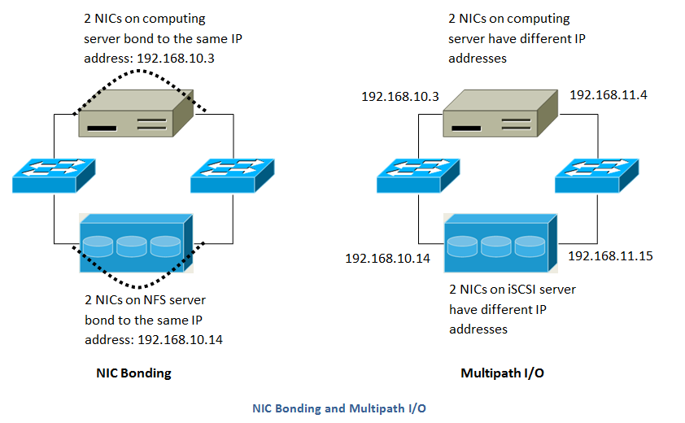
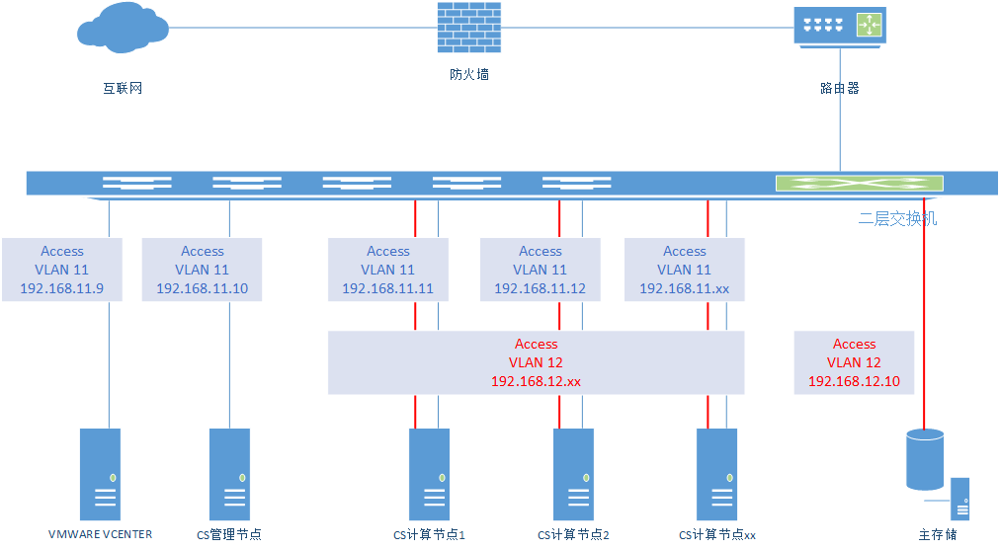
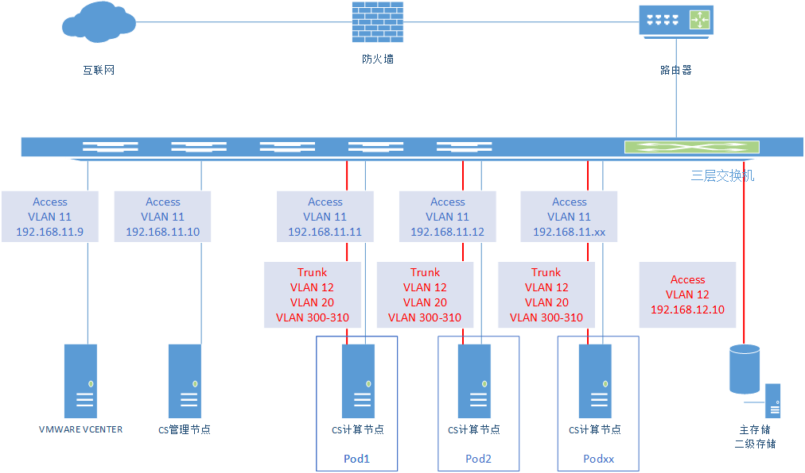

CloudStack 4.5 安装手册
==

## 概述

CloudStack是一个开源的具有高可用性及扩展性的云计算平台。支持管理大部分主流的hypervisors，如KVM，XenServer，VMware，Oracle VM，Xen等。同时CloudStack是一个开源云计算解决方案。可以加速高伸缩性的公共和私有云（IaaS）的部署、管理、配置。使用CloudStack作为基础，数据中心操作者可以快速方便的通过现存基础架构创建云服务。

### 架构示意图


这个图展示了CloudStack在大规模部署时的网络结构。

* 三层交换层处于数据机房的核心位置。应该部署类似VRRP的冗余路由协议实现设备热备份。通常，高端的核心交换机上包含防火墙模块。如果三层交换机上没有集成防火墙功能，也可以使用独立防火墙设备。防火墙一般会配置成NAT模式，它能提供如下功能：

 * 将来自Internet的HTTP访问和API调用转发到管理节点服务器。管理服务器的网络属于管理网络.
 * 当云跨越多个区域（Zone）时，防火墙之间应该启用site-to-site VPN，以便让不同区域中的服务器之间可以直接互通。

* layer-2的接入交换层连接到每个提供点（POD），也可以用多个交换机堆叠来增加端口数量。无论哪种情况下，都应该部署冗余的二层交换机。

* 管理服务器集群(包括前端负载均衡节点，管理节点及MYSQL数据库节点)通过两个负载均衡节点接入管理网络。

* 辅助存储服务器接入管理网络。

* 每一个机柜提供点（POD）包括存储和计算节点服务器。每一个存储和计算节点服务器都需要有冗余网卡连接到不同的 layer-2 接入交换机上。

### 存储网络
存储的数据流量过大可能使得管理网络过载。部署时可选择将存储网络分离出来。存储协议如iSCSI，对网络延迟非常敏感。独立的存储网络能够使其不受来宾网络流量波动的影响。


这个图展示了使用独立存储网络的设计。每一个物理服务器有四块网卡，其中两块连接到提供点级别的交换机，而另外两块网卡连接到用于存储网络的交换机。

有两种方式配置存储网络：

* 为NFS配置网卡绑定和冗余交换机。在NFS部署中，冗余的交换机和网卡绑定仍然处于同一网络。(同一个CIDR 段 + 默认网关地址)
* iSCSI能同时利用两个独立的存储网络(两个拥有各自默认网关的不同CIDR段)。支持iSCSI多路径的客户端能在两个独立的存储网络中实现故障切换和负载均衡。



此图展示了网卡绑定与多路径IO(MPIO)之间的区别，网卡绑定的配置仅涉及一个网段，MPIO涉及两个独立的网段。

## 最佳实践

部署云计算服务是一项挑战。这需要在很多不同的技术之间做出选择，CLOUDSTACK以其配置灵活性可以使用很多种方法将不同的技术进行整合和配置。这个章节包含了一些在云计算部署中的建议及需求。

这些内容应该被视为建议而不是绝对性的。然而，我们鼓励想要部署云计算的朋友们，除了这些建议内容之外，最好从CLOUDSTACK的项目邮件列表中获取更多建议指南性内容。

### 实施最佳实践
* 强烈建议在系统部署至生产环境之前，有一个完全模拟生产环境的集成系统。对于已经在CloudStack中做了自定义修改的系统来说，更为重要了。

*  应该为安装，学习和测试系统预留充足的时间。简单网络模式的安装可以在几个小时内完成。但首次尝试安装高级网络模式通常需要花费几天的时间，完全安装则需要更长的时间。正式生产环境上线前，通常需要4-8周用以排除集成过程中的问题，你也可从cloudstack-users的邮件列表里得到更多帮助。

### 安装最佳实践
* 每一个主机都应该配置为只接受已知设备的连接，如CLOUDSTACK管理节点或相关的网络监控软件。

* 如果需要达到一定的高密度，可以在每个机柜提供点里部署多个集群。

* 主存储的挂载点或是LUN不应超过6TB大小。每个集群中使用多个小一些的主存储比只用一个超大主存储的效果要好。

* 在主存储上输出共享数据时，可用限制访问IP地址的方法避免数据丢失。更多详情，可参考”Linux NFS on Local Disks and DAS” “Linux NFS on iSCSI”这些章节。

* 网卡绑定技术可以明显的增加系统的可靠性。

* 当有大量服务器支持相当多的虚拟机时，推荐在存储访问的网络上采用将10G的带宽。

* 主机可创建的虚拟机的能力，主要取决于提供给客户虚拟机的内存。因为主机的存储和CPU均可超配，但内存却基本不可以。所以内存是在系统容量设计时的主要限制因素。

* (XenServer)可以为Xenserver的dom0分配更多的内存来让其支持更多的虚拟机。我们推荐为dom0设置的内存数值为2940 MB。至于具体操作，可以参见如下URL：http://support.citrix.com/article/CTX126531。这篇文章可同时适用于XenServer 5.6和6.0版本。

### 维护最佳实践
* 监视主机的磁盘空间。很多主机故障的原因都是日志将主机的硬盘空间占满导致的。

* 要监控每个集群里的虚拟机总量，如果达到了hypervisor所能承受的最大虚拟机数量时，就要禁止向此集群分配虚机。并且，要确定预留一定的安全迁移容量，以防止群集中有主机故障，这将增大其他主机运行虚拟机压力，就像是重新部署一批虚拟机一样。咨询你选择 hypervisor的文档，找到每台主机所能支持的最大虚拟机数量，并将此数值作为默认限制配置在CLOUDSTACK的全局设置里。监控每个群集中虚拟机的活动，保持虚拟机数量在安全线内，以防止偶然的主机故障。例如：如果集群里有N个主机，如果要让集群中一主机在任意时间停机，那么，此集群最多允许的虚拟机数量值为：(N-1) * (每宿主机最大虚拟量数量限值)。一旦达到此数量，必须在CLOUDSTACK的UI里禁止向此群集增加新的虚拟机。

## 环境要求
### 管理节点支持OS版本：
* RHEL versions 6.3, 6.5, 6.6 and 7.0
* CentOS versions 6.6, 7.0
* Ubuntu 14.04 LTS
软件需求：
* Java 1.7
* MySQL 5.6 (RHEL 7)
* MySQL 5.1 (RHEL 6.x)

### 虚拟化版本：
* LXC Host Containers on RHEL 7
* Windows Server 2012 R2 (with Hyper-V Role enabled)
* Hyper-V 2012 R2
* CentOS 6.2+ with KVM
* Red Hat Enterprise Linux 6.2 with KVM
* XenServer versions 6.1, 6.2 SP1 and 6.5 with latest hotfixes
* VMware versions 5.0 Update 3a, 5.1 Update 2a, and 5.5 Update 2
* Bare metal hosts are supported, which have no hypervisor.
These hosts can run the following operating systems:
* RHEL or CentOS, v6.2 or 6.3
     > Note：Use libvirt version 0.9.10 for CentOS 6.3

* Fedora 17
* Ubuntu 12.04

### 外部设备：

* Netscaler VPX and MPX versions 9.3, 10.1e and 10.5
* Netscaler SDX version 9.3, 10.1e and 10.5
* SRX (Model srx100b) versions 10.3 to 10.4 R7.5
* F5 11.X
* Force 10 Switch version S4810 for Baremetal Advanced Networks

### 浏览器：

* Internet Explorer versions 10 and 11
* Firefox version 31 or later
* Google Chrome version 36.0.1985
* Safari 6+

## 环境规划

### 主机规划

| 主机名   | IP地址      |  用途                    |系统             | 备注       |
| -------- | :-----      | :----:                  | :----:           |:----:      |
|cs        |192.168.3.10 |   管理节点,mysql,cleint | centos6.6 x64    |    8核,8G  |
|vcenter   |192.168.3.9  |	vcenter              | VMWARE vCenter	| 	16核,8G |
|xencenter |192.168.3.8  |	xencenter            | Xencenter        | 	16核,8G
|nfs       |192.168.5.10 |	二级存储,镜像，nfs，http |centos6.6 x64| 	16核,32G，320G|
|nr1r01n01 |192.168.3.11 |	计算节点	           | VMWARE esxi 5.5| 	16核,64G|
|nr1r01n02 |192.168.3.12 |	计算节点             | VMWARE esxi 5.5| 	16核,64G|
|nr1r01n03 |192.168.3.13 |	计算节点 	           | VMWARE esxi 5.5| 	16核,64G|
|nr1r01n04 |192.168.3.14 |	计算节点       	 | VMWARE esxi 5.5| 	16核,64G|
|nr1r01n05 |192.168.3.15 |	计算节点             | VMWARE esxi 5.5| 	16核,64G|
|nr1r01n06 |192.168.3.16 |	计算节点         	 | VMWARE esxi 5.5| 	16核,64G|
|nr1r01n07 |192.168.3.17 |	计算节点             | VMWARE esxi 5.5| 	16核,64G|
|nr1r01n08 |192.168.3.18 |	计算节点       	 | VMWARE esxi 5.5| 	16核,64G|

### Basic Zone
Basic Zone需要配置3种网络流量类型，分别为Management Network、Guest Network、Storage Network，具体规划信息如下表：

| Network类型       | 说明              |  VLAN ID | IP Range     |CIDR |
| --------          | :-----           | :----:   |  :----:      |  :----:      |  :----:      |
| Management Network| 管理服务器所在网络 |  access 3   | 192.168.3.30~50   |192.168.3.0/24|
| Management Network| 主机所在的网络     | access  3   | 192.168.3.11~29   |192.168.3.0/24|
| Guest Network     | 用户的私有网络     | access  3  |    |192.168.3.0/24 |
| Storage Network   | 主存储，二级存储所在的存储网络 |  50  | |192.168.50.0/24|

连接示意图如下图所示：


### Advanced Zone

| Network类型       | 说明              |  VLAN ID  | IP Range     |CIDR |
| --------          | :-----           | :----:    |  :----:      |:----:      |
| Management Network| 管理服务器所在网络 |  3   |   |192.168.3.0/24|
| Management Network| Pod1的主机管理网络 |   4  |     |192.168.4.0/24|
| Management Network| Pod2的主机管理网络 |   5  |    |192.168.5.0/24|
| Public Network    | 公共网络          |   60  |     |192.168.60.0/24 |
| Guest Network     | 用户的私有网络     |   601-650 | |10.1.1.0/24 |
| Storage Network   | 主存储，二级存储所在的存储网络 |  50|  |192.168.50.0/24|

连接示意图如下图所示：


## 部署虚拟化环境
### 部署VMware虚拟化环境

#### 安装VMware ESXi

#### 安装VMware vCenter

#### 配置VMware vCenter

### 部署KVM虚拟化环境

### 部署XenServer虚拟化环境
#### 安装XenServer
#### 安装XenServer Support Package
#### 安装XenCenter
#### 配置XenCenter

## 配置存储


CloudStack使用了两种网络存储。一种是主存储，主存储用于存放虚拟机硬盘文件。主存储也可使用本地存储，并非必需使用网络存储。二级存储用于存放虚拟机模板/快照/ISO文件，二级存储只能使用网络存储。

Primary Storage：

Primary Storage（主存储）和Cluster/Zone相关，它为运行于集群内的所有虚拟机提供磁盘存储卷。 你可以为一个区域或集群配置一个或多个主存储服务器（至少需要为一个集群配置一个主存储服务器）， 主存储一般靠近主机，以便提高性能。 Cloudstack负责把主存储分配给虚拟机。

主存储使用存储标签的概念，每个主存储可以和0个，1个或多个存储标签关联。

当某个虚拟机启动的时候，或某个数据磁盘第一个挂载到某个虚拟机的时候，存储标签就可以用于标识哪个主存储可以挂载到虚拟机。 主存储可以是静态的或动态的。

在静态情况下，管理员必须给Cloudstack预先配置一定数量的存储（例如一个SAN的一个Volumn），Cloudstack可以放很多Volumn到它的存储上。

在动态模式下，管理员可以给Cloudstack分配一个存储系统（例如一个SAN），Cloudstak通过和这个存储系统的插件配合，可以实现动态建立存储卷。

Cloudstack可以支持所有标准的iSCSI和NFS Server。

Secondary Storage：

Secondary storage（二级存储）主要保存以下数据：
Templates（模板）— OS 镜像，可用于引导虚拟机，可以包含其它配置信息，如安装好的软件。 ISO镜像 — 包含数据或引导媒介的磁盘镜像，就是可以刻盘启动的iso文件。 磁盘存储卷的快照 — 保存虚拟机数据的拷贝，可用于数据恢复或建立新的模板。

二级存储的内容对对其范围内的所有主机都是可用的，范围一般指一个区域（Zone）或一个区划（Region）。
二级存储一般配置为对一个Zone可用的NFS形式，为了使副存储对所有云的主机可用，可以引入对象存储，这样就不必在Zone间复制模板和快照。

Cloudstack提供了Swift和Amazon S3的插件。当使用以上两种存储之一，你可以首先为整个Cloudstack配置对象存储，然后为每个Zone建立NFS中间存储，中间存储的作用是为所有模板和其它副存储数据存储到对象存储系统时提供临时存储。


### 主存储、二级存储

存储节点使用一台服务器，我们这里以NFS为例，NFS共享目录：/secondary。

#### 1. 安装NFS
```shell
# yum install nfs-utils -y
# yum	install	rpcbind	-y
```
#### 2. 创建存储目录
```shell
# mkdir -p /export/primary
# mkdir -p /export/secondary
```
#### 3. 配置NFS
```shell
# echo "/export *(rw,async,no_root_squash,no_subtree_check)" >/etc/exports
# exportfs -a
```
编辑/etc/export 文件，设置存储的路径,Export /export 目录。
```shell
# vi  /etc/sysconfig/nfs
LOCKD_TCPPORT=32803
LOCKD_UDPPORT=32769
MOUNTD_PORT=892
RQUOTAD_PORT=875
STATD_PORT=662
STATD_OUTGOING_PORT=2020
RPCNFSDARGS="-N	4"			#	对于KVM集群是必须的,	 否则存储异常导致系统
虚机无法启动
```
修改 /etc/sysconfig/nfs，将其中的端口号全部打开。
#### 4. 配置防火墙
```shell
#
iptables -A INPUT -s 0.0.0.0/0 -m state --state NEW -p udp --dport 111 -j ACCEPT
iptables -A INPUT -s 0.0.0.0/0 -m state --state NEW -p tcp --dport 111 -j ACCEPT
iptables -A INPUT -s 0.0.0.0/0 -m state --state NEW -p tcp --dport 2049 -j ACCEPT
iptables -A INPUT -s 0.0.0.0/0 -m state --state NEW -p tcp --dport 32803 -j ACCEPT
iptables -A INPUT -s 0.0.0.0/0 -m state --state NEW -p udp --dport 32769 -j ACCEPT
iptables -A INPUT -s 0.0.0.0/0 -m state --state NEW -p tcp --dport 892 -j ACCEPT
iptables -A INPUT -s 0.0.0.0/0 -m state --state NEW -p udp --dport 892 -j ACCEPT
iptables -A INPUT -s 0.0.0.0/0 -m state --state NEW -p tcp --dport 875 -j ACCEPT
iptables -A INPUT -s 0.0.0.0/0 -m state --state NEW -p udp --dport 875 -j ACCEPT
iptables -A INPUT -s 0.0.0.0/0 -m state --state NEW -p tcp --dport 662 -j ACCEPT
iptables -A INPUT -s 0.0.0.0/0 -m state --state NEW -p udp --dport 662 -j ACCEPT
# iptables-save > /etc/sysconfig/iptables
# service iptables status
```

#### 5. 启动NFS服务
```shell
# service nfs start
# service rpcbind start
```

#### 6. 设置服务为自动启动
```shell
# chkconfig nfs on
# chkconfig rpcbind on
```
重启服务器

### 文件服务器

#### 1. 安装httpd服务
```shell
# yum install httpd -y
# service httpd start
```
#### 2. 上传系统镜像，系统模版至/var/www/html目录。

## 部署CloudStack
### 配置系统相关服务

#### 1. 配置IP
```shell
# echo "IPADDR=192.168.3.10
NETMASK=255.255.255.0
GATEWAY=192.168.3.254" >> /etc/sysconfig/network-scripts/ifcfg-eth0
# sed -i 's/dhcp/static' /etc/sysconfig/network-script/ifcfg-eth0
# sed -i 's/ONBOOT=no/ONBOOT=yes' /etc/sysconfig/network-script/ifcfg-eth0
```
#### 2. 配置主机名
```shell
# echo "cs"> /etc/sysconfig/network
# hostname -F /etc/sysconfig/network
# echo "192.168.3.10   cs cs.cloud.com">> /etc/hosts
# hostname --fqdn
//检查配置是否有效
```
#### 3. 关闭 selinux
```shell
# getenforce
//查看当前 selinux 状态
# setenforce 0
//临时设置 selinux 状态
# sed -i 's/enforcing/disabled/' /etc/selinux/config
//修改 selinux 配置文件，重启永久禁用
```
#### 4. 配置系统的本地 yum 源
```shell
# yum clean all & yum makecache
```
#### 5. 配置 ntp 服务器
```shell
# yum install ntp  -y
# vi /etc/ntp.conf
//编辑 ntp 配置文件，将服务器替换成可用对时服务器。
# service ntpd restart
# chkconfig ntpd on
//重启 ntp 服务，并且设置其开机启动
```
#### 6. 确认管理节点没有安装JDK6或者其他较低的版本，如有安装，先卸载该JDK，再进行进行下面的步骤
。（cs4.4开始改用JDK7）
```shell
# java -version
```

### 安装CloudStack

#### 1. 配置cloudstack的yum源
```shell
# echo "[cloudstack-source]
name=cloudstack
baseurl=http://192.178.102.249/cloudstack/centos/4.5/
enabled=1
gpgcheck=0" > /etc/yum.repos.d/cloudstack.repo
```
实验室已将yum源同步到本地，不同版本配置不同，具体配置时以实际版本为准。
#### 2. 安装cloudstack
```shell
# yum install -y cloudstack-management
```
#### 3. 安装cloudstack-agent
```shell
# yum install -y cloudstack-agent
```
仅在KVM主机节点安装。

### 安装数据库

#### 1. 安装mysql
```shell
# yum install mysql-server -y
```
CloudStack使用mysql管理数据，但安装cloudstack-management时没有包含mysql，需要手动安装，并导入数据。数据库可以被安装到其它机器上。
  注意：允许远程mysql连接，方便以后查找问题

#### 2. 修改mysql配置
```shell
# echo "[mysqld]
datadir=/var/lib/mysql
socket=/var/lib/mysql/mysql.sock
user=mysql
# Disabling symbolic-links is recommended to prevent assorted security risks
symbolic-links=0
innodb_rollback_on_timeout=1
innodb_lock_wait_timeout=600
max_connections=350
log-bin=mysql-bin
binlog-format = 'ROW'
[mysqld_safe]
log-error=/var/log/mysqld.log
pid-file=/var/run/mysqld/mysqld.pid" >/etc/my.cnf
```
max_connections 的参数应设置 350 乘以你准备部署的管
理节点的数量。这里假定只安装一个管理节点。

#### 3. 修改mysql安全
```shell
# service mysqld start
# chkconfig mysqld on
# mysql_secure_installation
# service mysqld restart
Stopping mysqld:                                           [  OK  ]
Starting mysqld:                                           [  OK  ]
# /sbin/iptables -I INPUT -p tcp --dport 3306 -j ACCEPT
# /etc/rc.d/init.d/iptables save
```
缺省安装的 mysql 安全级别比较低，需要手工设置 mysql 下密码、禁用远程访问，删除无用账户及测试数据库。

#### 4. 导入数据
```shell
# cloudstack-setup-databases cloud:111111@localhost --deploy-as=root:111111
```
数据库准备好后，需导入 CloudStack 的表及基础数据，这样云平台才能正常使用。
如果没有意外的话，最后会输出 CloudStack has successfully initialized database
字样，表示数据库已经准备好了。
版本4.5在安装时数据库升级可能会失败，确认错误，重复两次即可。

### 启动CloudStack

#### 1. 配置管理服务器服务并启动服务，检查服务状态。
```shell
# cloudstack-setup-management
# service cloudstack-management status
# tail -n 200 -f /var/log/cloudstack/management/catalina.out
```
### 安装上传系统模版

#### 1. 确定模版版本

  CloudStack使用一组系统虚机来提供访问虚机控台，各种网络服务和管理存储的功能。当你引导云的时候，该步骤会获取这些准备用于部署的系统镜像。现在我们要从刚刚挂载的共享存储上面下载虚机模板并部署它们。管理服务器上有一个脚本来操作这些系统虚机镜像。这里的模版已装好的数据库中看到系统使用的模版地址，下载对应版本即可：
```SQL
SQL> SELECT NAME,URL FROM vm_template; ```
直接下载即可：
```shell
# wget http://download.cloud.com/templates/4.5/systemvm64template-4.5-vmware.ova
```
#### 2. 挂载nfs
```shell
# mount -t nfs 192.168.50.10:/export/secondary /mnt
```
在管理服务器上挂载二级存储.
#### 3. 导入系统模版
```shell
# /usr/share/cloudstack-common/scripts/storage/secondary/cloud-install-sys-tmplt \
-m /mnt \
-u http://192.178.102.249/cloudstack/systemvm64template-4.4.1-7-vmware.ova \
-h vmware \
-F
```

## 配置CloudStack

### 创建Basic Zone

### 创建Advanced Zone
