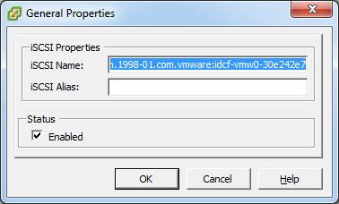

VMware vSphere 安装和配置
--------------------------------

- [VMware vSphere要求](#VMware vSphere要求)
  - [vSphere ESXi软件要求](#vSphere ESXi软件要求)
  - [vSphere ESXi硬件要求](#vSphere ESXi硬件要求)
  - [vSphere vCenter要求](#vSphere vCenter要求)
  - [其他要求](#其他要求)
- [VMware的准备工作清单](#VMware的准备工作清单)
  - [vCenter检查清单](#vCenter检查清单)
  - [VMware网络清单](#VMware网络清单)
- [vSphere ESXi安装](#vSphere ESXi安装)
  - [vSphere ESXi主机配置](#vSphere ESXi主机配置)
  - [vSphere vCenter管理网络配置](#vSphere vCenter管理网络配置)
  - [为CloudStack控制台代理扩展端口范围](#为CloudStack控制台代理扩展端口范围)
  - [配置vSphere的网卡绑定](#配置vSphere的网卡绑定)
  - [配置VMware数据中心使用VMware分布式虚拟交换机](#配置VMware数据中心使用VMware分布式虚拟交换机)
  - [在CloudStack中启用分布式虚拟交换机](#在CloudStack中启用分布式虚拟交换机)
  - [在CloudStack中配置分布式虚拟交换机](#在CloudStack中配置分布式虚拟交换机)
  - [ vSphere的存储准备(仅限iSCSI)](#vSphere的存储准备(仅限iSCSI))
  - [ ESXi主机中启用iSCSI启动器](#ESXi主机中启用iSCSI启动器)
  - [ 添加iSCSI目标](#添加iSCSI目标)
  - [vSphere多路径(可选)](#vSphere多路径(可选))
  - [添加主机或配置集群(vSphere)](#添加主机或配置集群(vSphere))
- [VMware vSphere主机安装补丁程序](#VMware vSphere主机安装补丁程序)


如果计划使用VMware vSphere平台运行虚拟机，请在云中安装vSphere主机。
<a name="VMware vSphere要求"></a>
# VMware vSphere要求
<a name="vSphere ESXi软件要求"></a>
## vSphere ESXi软件要求

-  vSphere ESXi 和vSphere vCenter版本,支持4.1、5.0、 5.1 和 5.5，不支持4.0版本，支持vSphere ESX。

  建议使用vSphere标准版，需要考虑vSphere授权对CPU的限制。价格请参考 [vsphere_pricing](http://www.vmware.com/files/pdf/vsphere_pricing.pdf) 。

-  保持版本最新

  确保安装已发布的所有补丁程序。

 > 警告：
   安装一切必要的补丁程序，缺乏最新补丁程序可能会导致数据和虚拟机丢失。

<a name="vSphere ESXi硬件要求"></a>
## vSphere ESXi硬件要求

* 主机必须通过vSphere的兼容性认证。请查看[VMware硬件兼容性指南](http://www.vmware.com/resources/compatibility/search.php)。
* 所有主机必须为64位架构并且支持HVM(启用Intel-VT或AMD-V)。
* 同一群集中的所有节点必须为同一架构。CPU型号、数量和功能参数必须相同。
* 64位x86 CPU(多核性能更佳)
* 硬件虚拟化支持
* 4GB内存
* 36GB本地磁盘空间
* 至少一块网卡
* 静态分配的IP
<a name="vSphere vCenter要求"></a>
## vSphere vCenter要求

* 处理器 - 2颗2.0GHz的Intel或AMD x86 CPUs， 或更高的处理器。如果数据库跟VC在同一台服务器中，可能会需要更高的处理器。
* 内存 - 3GB。如果数据库跟VC在同一台服务器中，可能会需要更多内存。
* 磁盘空间 - 2GB。如果数据库跟VC在同一台服务器中，可能会需要更多的磁盘空间。
* Microsoft SQL Server 2005 Express磁盘要求。最多需要2GB 的可用磁盘空间解压安装文件。
* 网络 - 1Gbit或者10Gbit。

更多信息，请参考vCenter Server 和 vSphere Client [硬件要求](http://pubs.vmware.com/vsp40/wwhelp/wwhimpl/js/html/wwhelp.htm#href=install/c_vc_hw.html)。

<a name="其他要求"></a>
## 其他要求

-  必须配置vCenter使用443端口与CloudStack管理服务器通讯。

-  如果你计划利用之前安装的主机，那么必须重新安装VMware ESXi。

-  CloudStack 管理网络不能使用独立的虚拟网络。CloudStack使用vCenter的管理网络，并继承vCenter管理网络的配置。 可参考 配置vCenter管理网络..

- 所有用于CloudStack的资源只能被CloudStack使用。CloudStack无法与其他管理控制台共享ESXi实例或存储。请不要与其他不受CloudStack管理的ESXi共享同一个存储卷。

-  将所有目标ESXi hypervisors加入vCenter中独立数据中心之下的群集。

- 将被CloudStack管理的群集中不应该存在任何VM。且不应该在CloudStack管理的群集中运行任何管理服务器、vCenter或者VM。为CloudStack创建一个独立的群集，并确保群集中不存在VM。

-  所有必需的vlan必须通过所有网络交换机端口的trunk模式连接到ESXi hypervisor主机。其中包含管理，存储，vMotion和来宾等VLANs。CloudStack管理一段连续的来宾VLANs范围(高级网络；请参阅 网络设置) 。

<a name="VMware的准备工作清单"></a>
# VMware的准备工作清单

为了能顺利地安装，在安装之前请收集以下信息：
<a name="vCenter检查清单"></a>
## vCenter检查清单

你需要关于vCenter的下列信息。

| vCenter要求      |备注|
|              --- | ---|
| vCenter用户       | 用户必须拥有管理员权限|
| vCenter用户的密码 | 上述用户的密码       |
| vCenter数据库名称 | 数据中心名称         |
| vCenter群集名称   | 群集名称             |

<a name="VMware网络清单"></a>
## VMware网络清单

| VLAN信息  | 备注 |
|              --- | ---|
| ESXi VLAN	全部ESXi  | hypervisors主机所在的VLAN。 |
| ESXi VLAN IP地址  | ESXi VLAN的IP地址范围。每个虚拟路由器使用该范围内的一个IP。 |
| ESXi VLAN网关IP  | ESXi VLAN子网掩码 |
| 管理服务器VLAN  | CloudStack管理服务器所在的VLAN。 |
| 公共网络VLAN  | 公共网络的VLAN |
| 公共网络VLAN的网关  | 公共网络VLAN的子网掩码 |
| 公共VLAN IP地址范围 |  CloudStack使用的公共网络IP范围。CloudStack中的虚拟路由器使用这些地址，用于路由专用流量至外部网络。 |
| 客户使用的VLAN范围 |  连续的不可路由的VLAN范围。每个用户会分配一个VLAN。 |
<a name="vSphere ESXi安装"></a>
# vSphere ESXi安装

* 准备好安装介质。

* 安装过程中，执行下面几个章节描述的以下配置：

|  要求|  可选项|
|              --- | ---|
|  ESXi主机安装|  网卡绑定|  
|  配置主机的物理网络，虚拟交换机，vCenter管理网络和扩展的端口范围|  存储多路径|  
|  准备iSCSI存储|  |  
|  在vCenter中配置集群并添加主机，或不使用集群，直接在vCenter中添加主机。|  |  
<a name="vSphere ESXi主机配置"></a>
## vSphere ESXi主机配置

所有ESXi主机都应该在BIOS中启用CPU硬件虚拟化支持。请注意，大多数服务器默认不启用该功能。

* 物理主机网络

您应该准备一个vSphere主机连接的规划。将主机添加至CloudStack之前，需要合理地配置网络。要配置ESXi主机，可以先用vClient将它作为独立主机添加到vCenter。当您在vCenter的导航树中看到该主机时，点击它，选择配置页。


在主机的配置标签页中，点击”硬件/网络”链接转到上图中的网络配置页。

* 配置虚拟交换机

默认情况下，系统会创建虚拟交换机vSwitch0。你可以视你的架构额外创建虚拟机交换机。CloudStack要求云中所有ESXi主机中的虚拟交换机都使用相同的名字。如果你改变了默认虚拟交换机名称，那么你需要改变一个或多个CloudStack配置。

* 流量隔离

CloudStack允许你使用vCenter为每个ESXi主机配置三个独立的网络。CloudStack通过连接到的vSwitch名称识别网络。允许配置的网络分别为公共网络(与公共互联网之间的流量)，来宾网络(来宾-来宾流量)和管理网络(与管理服务器和存储之间的流量)。这3种网络可以使用1个虚拟交换机，也可以另外创建1个或者2个虚拟交换机分别来承载流量。

如果您想以这样的方式隔离流量，首先应按照vCenter的指南在vCenter中创建并配置虚拟交换机。请记录每种网络使用的虚拟交换机名称。您需要配置CloudStack使用这些虚拟交换机。

* 增加端口

ESXi主机的虚拟交换机默认有56个端口。我们建议设为最大允许数4088，有些可能无法设置，改为允许的最大值即可。要设置该值，请点击虚拟交换机的“属性…”链接(注意，不是网络的属性)。


在vSwitch属性对话框中，选择vSwitch，点击“编辑”，您将看到以下对话框：


在该对话框中，您可以修改端口数量。修改完后，需要重启ESXi主机使配置生效，。

<a name="vSphere vCenter管理网络配置"></a>
## vSphere vCenter管理网络配置

在vSwith属性对话框中，可以看到一个vCenter管理网络。CloudStack的管理网络也使用该网络。CloudStack要求正确配置vCenter的管理网络。在对话框中点击管理网络，然后点击编辑。


请确保配置以下设置：

* VLAN ID设置为期望的ID
* 启用vMotion。
* 启用管理流量。

如果ESXi主机具有多个VMKernel端口，且ESXi没有使用默认的“Management Network”作为管理网络名称，必须按照以下指南配置管理网络端口组，以便CloudStack可以发现管理网络。

- 在所有ESXi主机上使用同一个管理网络端口组名称。
- 在CloudStack管理界面中，点击配置-全局设置，修改vmware.management.portgroup为ESXi主机管理网络的标签。

<a name="为CloudStack控制台代理扩展端口范围"></a>
## 为CloudStack控制台代理扩展端口范围
> 仅适用于VMware vSphere 4.x

为使控制台代理可以和主机一起工作，需要扩展主机的防火墙端口范围。这是为了使控制台代理可以访问VMware的VM。为扩展端口范围，请登录到每台主机的VMware ESX服务控制台，然后执行以下命令：

```shell
esxcfg-firewall -o 59000-60000,tcp,in,vncextras
esxcfg-firewall -o 59000-60000,tcp,out,vncextras
```

<a name="配置vSphere的网卡绑定"></a>
## 配置vSphere的网卡绑定

vSphere主机的网卡绑定可以按照vSphere安装指南完成。


<a name=" 配置VMware数据中心使用VMware分布式虚拟交换机"></a>
## 配置VMware数据中心使用VMware分布式虚拟交换机

CloudStack支持在VMware vSphere环境中为虚拟网络配置VMware vNetwork分布式交换机（VDS）。本章节能帮助你在CloudStack中配置VMware VDS。每个vCenter服务器实例最多支持128 VDS实例，每个VDS实例最多可以管理500台VMware服务器。

关于VMware分布式虚拟交换机

在VMware vCenter服务器中的VMware VDS聚合主机层面虚拟交换机 。各个主机层面的虚拟交换机被抽象处理成一个在数据中心层面上横跨多个主机的大型 VDS，通过一个集中的接口，使用集中配置、管理、监控你的整个数据中心。实际上，VDS可以看作是数据中心层面中一个整体的虚拟交换机，通过VMware vCenter服务器管理数据中心中大量的主机网络。在虚拟机跨多个主机移动时保持其网络运行时状态，支持嵌入式监控和集中式防火墙服务。VDS能与标准虚拟交换机和 Nexus 1000V虚拟交换机一起部署或者独立部署。

先决条件和指南

* VMware VDS只支持CloudStack中的公共和来宾流量。
* VMware VDS不支持每种流量类型使用多个VDS。如果一个用户有多个VDS交换机，那么来宾网络和公共网络只能各使用一个VDS。
* 在同一个zone中可以为每个群集添加任何类型的交换机。当在群集中添加不同类型的交换机时，流量标签会被群集级别的覆盖。
* 管理和存储网络不支持使用VDS。因此在这些网络中使用标准交换机。
* 当你移除来宾网络时，对应vCenter中的dv端口组不会被移除。你必须手动在vCenter中删除。


准备工作清单

为了顺利的配置VMware VDS，在开始之前，请牢记添加到数据中心中的VDS名称：


如下需要使用VDS名称：

* 在创建zone的过程中配置公共网络和来宾网络时，在编辑流量标签对话框中配置交换机名称。

在创建zone的过程中配置来宾网络和公共网络流量类型时，请确保你选择了VMware vNetwork Distributed Virtual Switch。

   

* 当添加一个启用了VDS的VMware群集时，则显示公共网络流量vSwitch类型区域。
* 当在zone中更新交换机类型时，流量标签所使用的交换机名称。

在最后一种情况下流量标签格式是
[["Name of vSwitch/dvSwitch/EthernetPortProfile"][,"VLAN ID"[,"vSwitch Type"]]]

流量标签可以使用如下值：

-  empty string

-  dvSwitch0

-  dvSwitch0,200

-  dvSwitch1,300,vmwaredvs

-  myEthernetPortProfile,,nexusdvs

-  dvSwitch0,,vmwaredvs


The three fields to fill in are:

-  vCenter中 虚拟/分布式 虚拟交换机的名称。

默认值取决于虚拟交换机的类型：

   **vSwitch0**: 如果虚拟交换机的类型是VMware vNetwork标准虚拟交换机。

   **dvSwitch0**: 如果虚拟交换机类型为VMware vNetwork分布式虚拟交换机

   **epp0**: 如果虚拟交换机类型为Cisco Nexus 1000v分布式虚拟交换机

-  任何适用于这个流量的 VLAN ID

此时，该区域仅用于公共网络流量。来宾网络区域会被忽略并且留空。默认为空字符即假设特定流量类型不填加VLAN标签。
-  Type of virtual switch. Specified as string.

  合理且有效的值为 vmwaredvs, vmwaresvs, nexusdvs。

   **vmwaresvs**: 表示VMware vNetwork 标准虚拟交换机

   **vmwaredvs**: 表示VMware vNetwork 标准虚拟交换机

   **nexusdvs**: 代表Cisco Nexus 1000v分布式虚拟交换机。

   如果什么都没指定(留空)，基于全局参数指定的值，区域层面默认使用虚拟交换机。

   以下为全局配置参数：

   **vmware.use.dvswitch**: 设置为true则是在CloudStack部署时启用任意种类(VMware DVS和Cisco Nexus 1000v) 分布式交换机。如果设置为false，则CloudStack部署时使用的的虚拟交换机是标准虚拟交换机。

   **vmware.use.nexus.vswitch**: 如果vmware.use.dvswitch设置为false，则忽略该参数。设置为true则是部署CloudStack时启用Cisco Nexus 1000v分布式交换机。

<a name="在CloudStack中启用分布式虚拟交换机"></a>
### 在CloudStack中启用分布式虚拟交换机

在部署CloudStack时启用VDS，请在CloudStack管理界面中的全局设置页面中设置vmware.use.dvswitch parameter为true并重启管理服务器。只有启用了vmware.use.dvswitch参数，你才能在管理界面中指定VDS，并且CloudStack会忽略你指定的VDS-specific参数。另外，如果vmware.use.dvswitch参数的值为true且vmware.use.nexus.dvswitch参数的值为false，那么CloudStack中虚拟网络架构使用VDS。另外一个定义VDS配置的全局参数是vmware.ports.per.dvportgroup。它表示在VMware环境里每个VMware dvPortGroup中默认端口数量。默认是256。这个数值直接关系到你创建的来宾网络的数量。

CloudStack支持混合部署分布式虚拟交换机、标准虚拟交换机和Nexus 1000v虚拟交换机的虚拟网络。
<a name="在CloudStack中配置分布式虚拟交换机"></a>
### 在CloudStack中配置分布式虚拟交换机

在创建区域时需要添加必要的资源才能配置VDS。

另外在群集层面，使用添加群集选项，可以在已经存在并启用VDS的区域中创建附加群集。更多信息请参阅 “添加群集: vSphere”.

在所有情况下，配置VDS时必须指定下列参数：


| 参数描述 | |
| --- | ---|
| 群集名称   |  输入在vCenter中创建的群集名称。比如，”cloudcluster”。|
| vCenter主机 |   输入已经部署VMware VDS的vCenter主机名称或者IP地址。|
| vCenter用户名 |   输入CloudStack连接到vCenter所使用的用户名。这个用户必须拥有所有管理员权限。|
| vCenter 密码  |  输入上面用户的密码。|
| vCenter数据中心 |    输入群集所属的vCenter数据中心名称。比如，”clouddcVM”。|
| 替代公共流量   | 启用该选项时，整个区域中群集的公共流量将被替代。|
| 公共流量虚拟交换机类型    |   在启用替代公共流量时该选项才会显示。选择VMware vNetwork Distributed Virtual Switch。如果全局设置中vmware.use.dvswitch参数为true，则默认选项为VMware vNetwork Distributed Virtual Switch。|
| 公共流量虚拟交换机名称  |   用于公共流量的虚拟交换机名称。|
| 替代来宾流量  |    启用该选项时，整个区域中群集的来宾流量将被替代。|
| 来宾流量虚拟交换机类型   |     在启用替代来宾流量时该选项才会显示。选择VMware vNetwork Distributed Virtual Switch。如果全局设置中vmware.use.dvswitch参数为true，则默认选项为VMware vNetwork Distributed Virtual Switch。|
| 来宾流量虚拟交换机名称 |   用于宾流量的虚拟交换机名称。|

<a name="vSphere的存储准备(仅限iSCSI)"></a>
## vSphere的存储准备(仅限iSCSI)
使用iSCSI需要在vCenter中做一些准备工作。您必须添加iSCSI目标并创建iSCSI数据存储。

如果使用NFS，请跳过本章节。
<a name="ESXi主机中启用iSCSI启动器"></a>
### ESXi主机中启用iSCSI启动器


* 在vCenter中，点击主机/集群的配置，点击存储适配器。您将看到：

  

* 选择iSCSI软件适配器并点击属性。

  

* 点击配置...按钮。

   

* 勾选启用以便启用启动器。

* 点击 确定 保存。
<a name="添加iSCSI目标"></a>
### 添加iSCSI目标

在属性对话框中，添加iSCSI目标信息：


在集群中所有ESXi主机上重复以上步骤。


创建iSCSI数据存储

现在您应该创建一个VMFS数据存储。请按照以下步骤：

选择主页/清单/数据存储。
右键点击数据中心节点。
选择添加数据存储...命令。
按照向导创建iSCSI数据存储。
该过程只需要在集群中的一台主机上执行，不需要在所有主机上执行。


<a name="vSphere多路径(可选)"></a>
### vSphere多路径(可选)

vSphere的存储多路径可以根据vSphere的安装文档配置。

<a name="添加主机或配置集群(vSphere)"></a>
## 添加主机或配置集群(vSphere)

使用vCenter创建集群，向其中添加期望的主机。随后您可以将整个集群加入到Cloudstack中。(参考 “添加群集: vSphere”)。

<a name="VMware vSphere主机安装补丁程序"></a>
# VMware vSphere主机安装补丁程序

* 在CloudStack中断开与VMware vSphere 群集的连接。应断开足够长的时间以便在主机上安装补丁程序。

   * 使用admin账户登录CloudStack管理界面。
   * 导航至VMware群集，点击操作-取消管理。
   * 查看群集状态直到显示未受管理。

* 在集群中每个ESXi主机上执行以下操作：

   * 将集群中每个ESXi都置为维护模式。

   * 确保所有的VM已经迁移到群集中的其他主机。

   * 如果群集中只有一台主机，关闭所有VMs再将主机置为维护模式。

   * 在ESXi主机中应用补丁。

   * 如果提示重启，请重启主机。

   * 在主机上取消维护模式。

* 重新连接该集群到CloudStack:

   * 使用admin账户登录CloudStack管理界面。

   * 导航到VMware群集，点击操作-管理。

   * 查看状态以确保所有的主机都恢复正常。所有主机都恢复正常可能需要几分钟时间。
      或者，确认主机状态在数据库中得到正确同步和更新。
