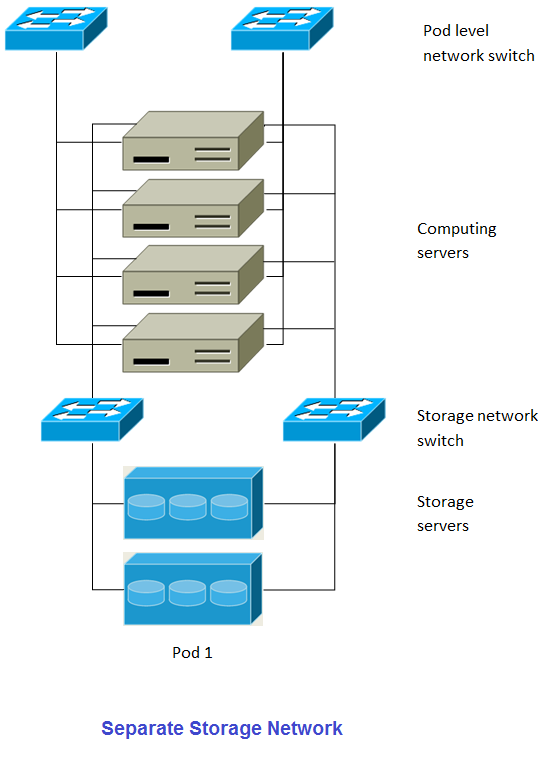
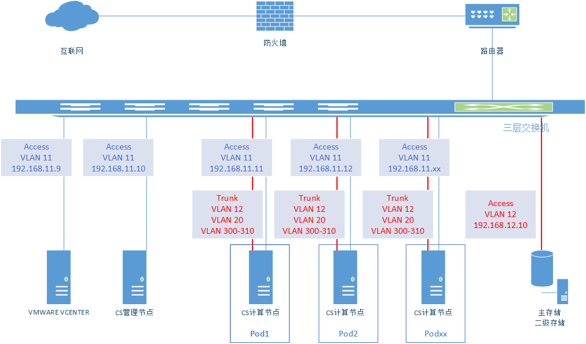

## 概述

CloudStack是一个开源的具有高可用性及扩展性的云计算平台。支持管理大部分主流的hypervisors，如KVM，XenServer，VMware，Oracle VM，Xen等。同时CloudStack是一个开源云计算解决方案。可以加速高伸缩性的公共和私有云（IaaS）的部署、管理、配置。使用CloudStack作为基础，数据中心操作者可以快速方便的通过现存基础架构创建云服务。

### 架构示意图

这个图展示了CloudStack在大规模部署时的网络结构。

* 三层交换层处于数据机房的核心位置。应该部署类似VRRP的冗余路由协议实现设备热备份。通常，高端的核心交换机上包含防火墙模块。如果三层交换机上没有集成防火墙功能，也可以使用独立防火墙设备。防火墙一般会配置成NAT模式，它能提供如下功能：

 * 将来自Internet的HTTP访问和API调用转发到管理节点服务器。管理服务器的网络属于管理网络.
 * 当云跨越多个区域（Zone）时，防火墙之间应该启用site-to-site VPN，以便让不同区域中的服务器之间可以直接互通。

* layer-2的接入交换层连接到每个提供点（POD），也可以用多个交换机堆叠来增加端口数量。无论哪种情况下，都应该部署冗余的二层交换机。

* 管理服务器集群(包括前端负载均衡节点，管理节点及MYSQL数据库节点)通过两个负载均衡节点接入管理网络。

* 辅助存储服务器接入管理网络。

* 每一个机柜提供点（POD）包括存储和计算节点服务器。每一个存储和计算节点服务器都需要有冗余网卡连接到不同的 layer-2 接入交换机上。

### 存储网络
存储的数据流量过大可能使得管理网络过载。部署时可选择将存储网络分离出来。存储协议如iSCSI，对网络延迟非常敏感。独立的存储网络能够使其不受来宾网络流量波动的影响。

这个图展示了使用独立存储网络的设计。每一个物理服务器有四块网卡，其中两块连接到提供点级别的交换机，而另外两块网卡连接到用于存储网络的交换机。

有两种方式配置存储网络：

* 为NFS配置网卡绑定和冗余交换机。在NFS部署中，冗余的交换机和网卡绑定仍然处于同一网络。(同一个CIDR 段 + 默认网关地址)
* iSCSI能同时利用两个独立的存储网络(两个拥有各自默认网关的不同CIDR段)。支持iSCSI多路径的客户端能在两个独立的存储网络中实现故障切换和负载均衡。

此图展示了网卡绑定与多路径IO(MPIO)之间的区别，网卡绑定的配置仅涉及一个网段，MPIO涉及两个独立的网段。

## 最佳实践

部署云计算服务是一项挑战。这需要在很多不同的技术之间做出选择，CLOUDSTACK以其配置灵活性可以使用很多种方法将不同的技术进行整合和配置。这个章节包含了一些在云计算部署中的建议及需求。

这些内容应该被视为建议而不是绝对性的。然而，我们鼓励想要部署云计算的朋友们，除了这些建议内容之外，最好从CLOUDSTACK的项目邮件列表中获取更多建议指南性内容。

### 实施最佳实践
* 强烈建议在系统部署至生产环境之前，有一个完全模拟生产环境的集成系统。对于已经在CloudStack中做了自定义修改的系统来说，更为重要了。

*  应该为安装，学习和测试系统预留充足的时间。简单网络模式的安装可以在几个小时内完成。但首次尝试安装高级网络模式通常需要花费几天的时间，完全安装则需要更长的时间。正式生产环境上线前，通常需要4-8周用以排除集成过程中的问题，你也可从cloudstack-users的邮件列表里得到更多帮助。

### 安装最佳实践
* 每一个主机都应该配置为只接受已知设备的连接，如CLOUDSTACK管理节点或相关的网络监控软件。

* 如果需要达到一定的高密度，可以在每个机柜提供点里部署多个集群。

* 主存储的挂载点或是LUN不应超过6TB大小。每个集群中使用多个小一些的主存储比只用一个超大主存储的效果要好。

* 在主存储上输出共享数据时，可用限制访问IP地址的方法避免数据丢失。更多详情，可参考”Linux NFS on Local Disks and DAS” “Linux NFS on iSCSI”这些章节。

* 网卡绑定技术可以明显的增加系统的可靠性。

* 当有大量服务器支持相当多的虚拟机时，推荐在存储访问的网络上采用将10G的带宽。

* 主机可创建的虚拟机的能力，主要取决于提供给客户虚拟机的内存。因为主机的存储和CPU均可超配，但内存却基本不可以。所以内存是在系统容量设计时的主要限制因素。

* (XenServer)可以为Xenserver的dom0分配更多的内存来让其支持更多的虚拟机。我们推荐为dom0设置的内存数值为2940 MB。至于具体操作，可以参见如下URL：http://support.citrix.com/article/CTX126531。这篇文章可同时适用于XenServer 5.6和6.0版本。

### 维护最佳实践
* 监视主机的磁盘空间。很多主机故障的原因都是日志将主机的硬盘空间占满导致的。

* 要监控每个集群里的虚拟机总量，如果达到了hypervisor所能承受的最大虚拟机数量时，就要禁止向此集群分配虚机。并且，要确定预留一定的安全迁移容量，以防止群集中有主机故障，这将增大其他主机运行虚拟机压力，就像是重新部署一批虚拟机一样。咨询你选择 hypervisor的文档，找到每台主机所能支持的最大虚拟机数量，并将此数值作为默认限制配置在CLOUDSTACK的全局设置里。监控每个群集中虚拟机的活动，保持虚拟机数量在安全线内，以防止偶然的主机故障。例如：如果集群里有N个主机，如果要让集群中一主机在任意时间停机，那么，此集群最多允许的虚拟机数量值为：(N-1) * (每宿主机最大虚拟量数量限值)。一旦达到此数量，必须在CLOUDSTACK的UI里禁止向此群集增加新的虚拟机。

## 环境要求
### 管理节点支持OS版本：
* RHEL versions 6.3, 6.5, 6.6 and 7.0
* CentOS versions 6.6, 7.0
* Ubuntu 14.04 LTS
软件需求：
* Java 1.7
* MySQL 5.6 (RHEL 7)
* MySQL 5.1 (RHEL 6.x)

### 虚拟化版本：
* LXC Host Containers on RHEL 7
* Windows Server 2012 R2 (with Hyper-V Role enabled)
* Hyper-V 2012 R2
* CentOS 6.2+ with KVM
* Red Hat Enterprise Linux 6.2 with KVM
* XenServer versions 6.1, 6.2 SP1 and 6.5 with latest hotfixes
* VMware versions 5.0 Update 3a, 5.1 Update 2a, and 5.5 Update 2
* Bare metal hosts are supported, which have no hypervisor.
These hosts can run the following operating systems:
* RHEL or CentOS, v6.2 or 6.3
     > Note：Use libvirt version 0.9.10 for CentOS 6.3

* Fedora 17
* Ubuntu 12.04

### 外部设备：

* Netscaler VPX and MPX versions 9.3, 10.1e and 10.5
* Netscaler SDX version 9.3, 10.1e and 10.5
* SRX (Model srx100b) versions 10.3 to 10.4 R7.5
* F5 11.X
* Force 10 Switch version S4810 for Baremetal Advanced Networks

### 浏览器：

* Internet Explorer versions 10 and 11
* Firefox version 31 or later
* Google Chrome version 36.0.1985
* Safari 6+

## 环境规划

### 设备配置说明
#### 路由器

路由器连接公网和内部网络，路由器内部ip地址为：192.168.6.1 ，与三层交换机g0/1连接。

|设备        | 物理接口 |  地址             | 功能                |备注    |
|------      | :-----  | :----:           |  :----:             |:----:  |
| 路由器 | e0/0    |  222.222.222.220 |  连接internet       |        |
|            | e0/1    |  192.168.6.1/24  |  内部接口，连接交换机 |        |

#### 交换机

交换机负责物理网络vlan划分，开启vlan间路由器，交换机的g0/1属于vlan 2，和路由器内网接口连接，vlan 2 ip地址为：192.168.6.254
二层交换机也可以，但是需要在路由器上做单臂路由。

|设备         | vlan    |  vlan  ip 网关    | 功能          |备注    |
|------       | :-----:| :----:            |  :----:       |:----:  |
| 交换机       | 2      |  192.168.6.254/24 | 连接出口路由器  |        |
|             | 11     |  192.168.11.1/24    | 计算节点出口网关 |        |
|             | 12     |  192.168.12.1/24    | Storage Network |        |
|             | 20     |  192.168.20.1/24    | Public Network     |        |
|             | 300-310|                   | Guest Network      |        |

|接口序号 | vlan  | 接口模式 | 连接服务器        |备注              |
|------  | :-----| :----:  |  :----:          |:----:            |
| g0/1   | 12    |  Access | nfs              |                  |
| g0/2   | 2     |  Access | 路由器内网接口     |                  |
| g0/3   | 11    |  Trunk  | cs               |  native vlan 11  |
| g0/4   | 11    |  Trunk  | nr1r01n01            |  native vlan 11  |
| g0/5   | 11    |  Trunk  | nr1r01n02            |  native vlan 11  |

#### 流量分类规划

|流量类型 |	VLAN |	        	CIDR  |		网关       |		起始IP    |		结束IP |备注|
|------   |------   | :-----             | :----:            |  :----:          |:----:            | :-----   |
|Public Network |	20   |		192.168.20.0/24 |		192.168.20.1 |	192.168.20.10	 |192.168.20.250 |公共流量
|Manage Network|	11	 |	192.168.11.0/24	 |	192.168.11.1 |		192.168.11.200	 |	192.168.11.229	 |	提供点，内部系统用的IP，如系统vm |
|Guest Network |	300-310	|	10.1.1.0/24	 |	10.1.1.1	 |	10.1.1.10	 |  10.1.1.250 |来宾流量，用户vm使用
|Storage Network|	11	   |	192.168.11.0/24	 |	192.168.11.1	 |	192.168.11.230	 |	192.168.11.249	 | 存储流量 |

高级区域配置成功后，客户vm将获得一个10.1.2.0网段的私有ip地址；系统将建立一个虚拟路由器Vrouter，这个虚拟路由器将作为用户vm 10.1.2.0 guest网段网关;同时这个路由器还将获得一个public的网段的ip地址；vm将通过Vrouter nat功能实现外部通信和对外提供服务。

Guest vm(10.1.2.x)→(10.1.2.1)Vrouter-nat(192.168.20.x) → (192.168.20.1)三层交换机(192.168.6.254）→
（192.168.6.1）路由器(nat)→wan

#### 主机规划

物理主机和管理服务器属于vlan 11 , 交换机连接计算节点的端口配置为trunk模式，允许所有vlan通过，本征vlan 为11；nfs为存储设备，连接交换机的接口配置为access模式，属于vlan 12。

| 设备名称   | IP地址     |  	网关    |	vlan |用途                    |系统             | 备注     |
| -------- | :-----      | :----:   |:----:|:----:                  | :----:         |:----:    |
|cs        |192.168.11.30 |192.168.11.1|	11	| 管理节点,mysql,client| centos6.6 x64  |   8核,8G |
|nfs       |192.168.12.29  |192.168.12.1|	12	|	虚拟化节点           |centos6.6 x64   | 	16核,32G，320G|
|vcenter   |192.168.11.28  |192.168.11.1|	11	|	vcenter             | VMWARE vCenter | 	16核,8G |
|xencenter |192.168.11.27  |192.168.11.1|	11	|	xencenter           | Xencenter      |  16核,8G  |
|nr1r02n19 |192.168.11.21  |192.168.11.1|	11	|	虚拟化节点	          | VMWARE esxi 5.5|  32核,64G|
|nr1r02n21 |192.168.11.22  |192.168.11.1|	11	|	虚拟化节点           | VMWARE esxi 5.5| 	32核,64G|
|nr1r01n01 |192.168.11.31 |192.168.11.1|	11	|	计算节点	           | VMWARE esxi 5.5| 	32核,64G|
|nr1r01n02 |192.168.11.32 |192.168.11.1|	11	|	计算节点             | VMWARE esxi 5.5| 	32核,64G|
|nr1r01n03 |192.168.11.33 |192.168.11.1|	11	|	计算节点 	           | VMWARE esxi 5.5| 	32核,64G|
|nr1r01n04 |192.168.11.34 |192.168.11.1|	11	|	计算节点          	 | VMWARE esxi 5.5| 	32核,64G|
|nr1r01n05 |192.168.11.35 |192.168.11.1|	11	|	计算节点             | VMWARE esxi 5.5| 	32核,64G|
|nr1r01n06 |192.168.11.36 |192.168.11.1|	11	|	计算节点          	 | VMWARE esxi 5.5| 	32核,64G|
|nr1r01n07 |192.168.11.37 |192.168.11.1|	11	|	计算节点             | VMWARE esxi 5.5| 	32核,64G|
|nr1r01n08 |192.168.11.38 |192.168.11.1|	11	|	计算节点          	 | VMWARE esxi 5.5| 	32核,64G|

### Basic Zone
Basic Zone需要配置3种网络流量类型，分别为Management Network、Guest Network、Storage Network，具体规划信息如下表：

|流量类型 |	VLAN |	        	CIDR  |		网关       |		起始IP    |		结束IP |备注|
|------  |------  | :-----| :----:  |  :----:          |:----:            | :-----   |
|Public Network |	 11  |	192.168.11.0/24  |	192.168.11.1 |	192.168.11.170	 |192.168.11.199 |公共流量, |
|Manage Network|	 11	 |	192.168.11.0/24	 |	192.168.11.1 |	192.168.11.200	 |	192.168.11.229	 |	提供点，内部系统用的IP，如系统vm |
|Guest Network |	 11	 |	192.168.11.0/24  |	192.168.11.1 |	192.168.11.100	 |  192.168.11.169 |来宾流量，用户vm使用, |
|Storage Network|	 11	 |	192.168.11.0/24	 |	192.168.11.1 |	192.168.11.230	 |	192.168.11.249	 | 存储流量 |

连接示意图如下图所示：

### Advanced Zone

|流量类型 |	VLAN |	        	CIDR  |		网关       |		起始IP    |		结束IP |备注|
|------  |------  | :-----| :----:  |  :----:          |:----:            | :-----   |
|Public Network |	20   |		192.168.20.0/24 |		192.168.20.1 |	192.168.20.10	 |192.168.20.250 |公共流量，后期可继续添加
|Manage Network|	11	 |	192.168.11.0/24	 |	192.168.11.1 |		192.168.11.120	 |	192.168.11.169	 |	提供点，内部系统用的IP，如系统vm |
|Guest Network |	300-310	|	10.1.1.0/24	 |	10.1.1.1	 |	10.1.1.10	 |  10.1.1.250 |来宾流量，用户vm使用
|Storage Network|	11	   |	192.168.11.0/24	 |	192.168.11.1	 |	192.168.11.170	 |	192.168.11.199	 | 存储流量，后期可继续添加 |

连接示意图如下图所示：

